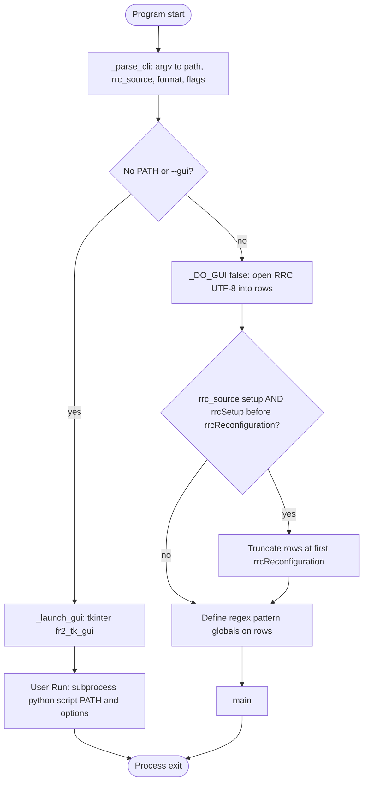
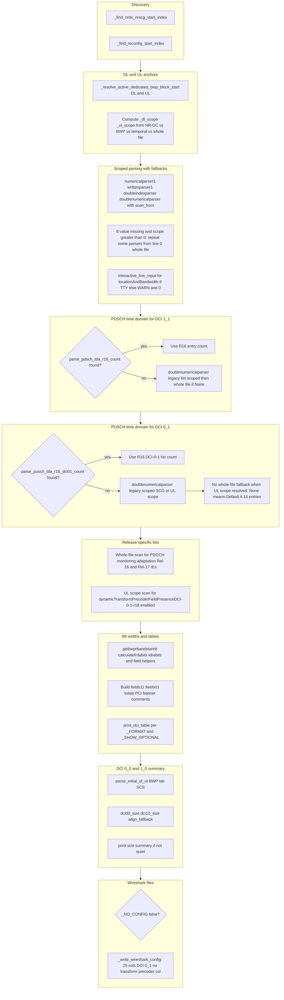
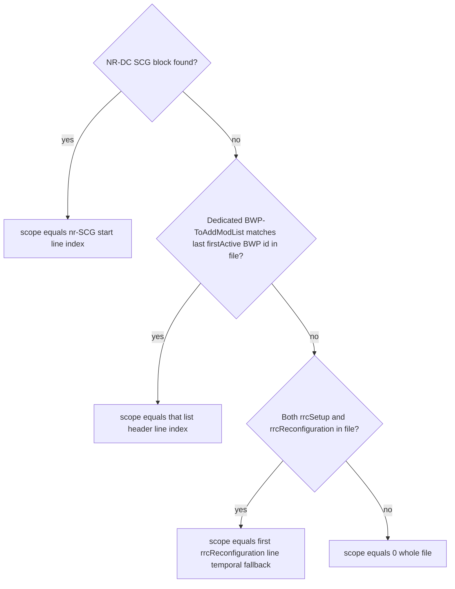
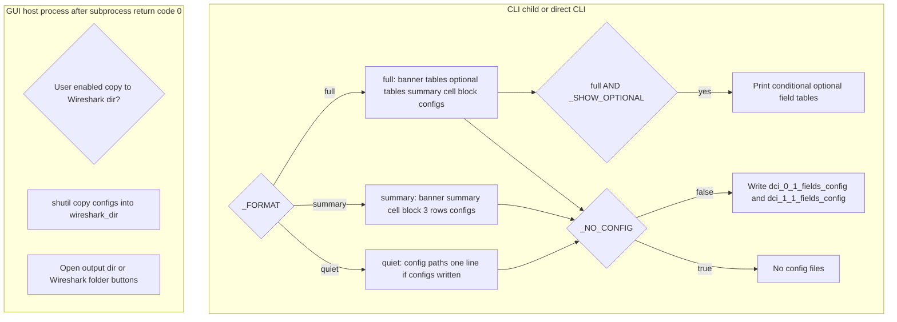

# FR2 DCI Helper — architecture and decision flow

This document describes how [`FR2_dci_helper.py`](FR2_dci_helper.py) works at a high level: entry points, RRC text loading, DL/UL scoping, parameter extraction, DCI bit-width derivation, and outputs. It is meant to stay aligned with the code; when behavior changes, update this file.

---

## 1. Executive summary

The tool reads a **plain-text RRC capture** (one line per log line). At import time it parses **CLI flags** and either launches a **tkinter GUI** ([`fr2_tk_gui.py`](fr2_tk_gui.py); stdlib, small frozen EXE) which re-invokes the same script as a **subprocess** with a file path, or loads the RRC file into a global `rows` list. An optional **PySide6** UI for source use is [`fr2_qt_gui.py`](fr2_qt_gui.py) (`python fr2_qt_gui.py` from `Try 2/`; not bundled in the default PyInstaller spec). **`main()`** first determines **scan anchors** for DL and UL (`_dl_scope`, `_ul_scope`) using NR-DC SCG detection, structural **active dedicated BWP** resolution, or fallbacks. It then walks RRC with those anchors (and selective whole-file fallbacks) to populate **typed configuration values**, feeds them into **small pure functions** that implement TS 38.212 / 38.214 / 38.331 field bit widths for **DCI 1_1** and **DCI 0_1**, prints **tables and summaries** according to `--format`, and optionally writes **Wireshark CSV configs** (`dci_0_1_fields_config`, `dci_1_1_fields_config`). A separate block computes **DCI 0_0 / 1_0** sizes for USS and CSS Type-3 using initial BWP parameters.

**Normative mapping (spec clause ↔ code):** see [`3GPP_SPEC_TRACEABILITY.md`](3GPP_SPEC_TRACEABILITY.md) and Word export [`3GPP_SPEC_TRACEABILITY.docx`](3GPP_SPEC_TRACEABILITY.docx) (regenerate with `python Try 2/build_spec_traceability_docx.py`; requires `python-docx`).

---

## 2. Diagram A — top-level entry

**Notes**

- GUI mode sets `rows = []` at import so helper definitions that reference `rrclength` do not crash; the real analysis runs in the **child** process with a real file.
- Child process has `_DO_GUI` false (no `--gui` in the assembled command), so it follows the `noGui` branch.

---

## 3. Diagram B — `main()` pipeline and key branches

**Transform precoder (Rel-18)**

- When `dynamicTransformPrecoderFieldPresenceDCI-0-1-r18` is `enabled` in the active UL scope, a **1-bit** field is included in the **display table** and in **`totallength01`**.
- **`_write_wireshark_config`** intentionally **does not** add a column for this field (Wireshark dissector gap).

---

## 4. Diagram C — DL/UL scan scope (`_dl_scope` / `_ul_scope`)

The same decision structure is evaluated independently for DL and UL (see `main()` around the block that sets `_dl_scope` and `_ul_scope`).

**Structural BWP resolution** (`_resolve_active_dedicated_bwp_block_start`): walks from the **last** `*BWP-ToAddModList` in the file backward until a list contains an entry whose `bwp-Id` matches the **last** `firstActive*UplinkBWP-Id` / `firstActiveDownlinkBWP-Id` seen while scanning the file (default active id **1** if never set).

---

## 5. Diagram D — output routing and GUI extras

The **guiOnly** nodes run in the **GUI host process** (tkinter by default) after the analysis **subprocess** exits with code 0 (they are not called from `main()` inside the child). **Gcopy** / **Gshutil** honor the user’s “copy to Wireshark folder” toggle and saved path. Before overwriting an existing `dci_0_1_fields_config` or `dci_1_1_fields_config` in that folder, the GUI copies the prior file(s) into **`fr2_dci_helper_backups/`** under the same Wireshark directory, using timestamped names (`*.YYYYMMDD_HHMMSS_microseconds.bak`).

ANSI colors follow `stdout.isatty()` unless `--no-color`.

**Cell parameters block** (printed for `full` and `summary`, not `quiet`): three rows — (1) identity: PCI (from `scramblingID0` / log header, else **RRC `physCellId`** from `parse_cell_identity_prefer_reconfig()`), band (`n258` style), SSB / Point A ARFCN, `servCellIndex`, NR-DC SCG flag, optional log-header NCGI/Freq; (2) active dedicated BWP geometry; (3) SCS, BWP counts, active `bwp-Id`. Identity IEs use `parse_cell_identity_prefer_reconfig()` (NR-DC SCG → first `rrcReconfiguration` → whole file for `spCellConfig` windows), then **`_enrich_cell_identity_loose`** fills missing band / SSB ARFCN / Point A from **`freqBandIndicatorNR`**, **`ssbFrequency`** or **`absoluteFrequencySSB`**, and **`absoluteFrequencyPointA`** anywhere in the file when `spCellConfigCommon` is absent (common in **reconfiguration-only** captures). **Do not use saved tool output (`verify_*.txt` prints) as input** — the tool rejects files that look like prior FR2_dci_helper banners/tables instead of live RRC.

**PDSCH FDRA (DCI 1_1)** — `parse_pdsch_ra_and_rbg_in_first_block` reads `resourceAllocation` and `rbg-Size` only inside the **first** `pdsch-Config` block at/after the DL anchor (avoids the old `doubleindexparser(..., pusch-ConfigC, ...)` end-marker that often scanned to EOF). `resourceAllocation` accepts both `resourceAllocation X` and `resourceAllocation : X` styles. When the block cannot be parsed, the legacy `doubleindexparser` / `writtenparser1` path is used.

**Max FDRA in cell-group window (DCI 1_1 commentary)** — `collect_max_fdr_bits_dci11_window` scans the **last** `downlinkBWP-ToAddModList` header in the same cell-group window used for DAI (`_dai_lo`–`_dai_hi`). For each BWP entry it finds `pdsch-Config` and derives FDRA bits (type0 RBG vs type1 RIV, including `dynamicSwitch` as max(type0, type1)+1 when applicable). It also considers orphan `pdsch-Config` lines with a backward `locationAndBandwidth` or the active BWP’s LAB fallback. If the **maximum** across that scan is **greater** than the active BWP’s `frdabitsdl`, the tool appends a short **38.212 §7.3.1**-oriented note to the DCI 1_1 FDRA row comment and prints an extra line under **DCI sizes (core formats)** in `full` / `summary`. **Wireshark CSV field totals** and the main DCI 1_1 bit table still use the **active** BWP’s FDRA unless a future flag changes that.

**Downlink assignment index (DCI 1_1)** — When `pdsch-HARQ-ACK-Codebook` is **dynamic**, DAI uses **4** bits if an `sCellToAddModList` header appears anywhere in the **cell-group window** (NR-DC SCG: from `mrdc-SecondaryCellGroup nr-SCG` to EOF; MN-only: from line 0 to the first `nr-SCG` line), otherwise **2** bits. `pdsch-HARQ-ACK-Codebook` is read from `physicalCellGroupConfig` in that same window (`writtenparser1` with `scan_from=_dai_lo`).

---

## 6. Appendix — function buckets

**Cursor agent map:** Task-oriented entry points for the same buckets live in [`.cursor/skills/fr2-dci-helper-code-map/SKILL.md`](../.cursor/skills/fr2-dci-helper-code-map/SKILL.md) (invoke with **@fr2-dci-helper-code-map** when `disable-model-invocation` is set). **Canonical list:** the table below is the authoritative list of representative functions; when you add or rename an entry point, update this table and keep the skill’s matching section in sync.

| Role | Representative functions |
|------|---------------------------|
| CLI and lifecycle | `_parse_cli`, `_launch_gui` → `fr2_tk_gui.main`, `_interactive_line_input`, `_load_settings` / `_save_settings` |
| Scope and message structure | `_find_nrdc_nrscg_start_index`, `_find_reconfig_start_index`, `_resolve_active_dedicated_bwp_block_start`, `_walk_bwp_list_for_active_entry` |
| Prefer reconfiguration | `parse_scalar_prefer_reconfig`, `parse_maxrank_prefer_reconfig`, `parse_nrofsrsports_prefer_reconfig`, `parse_betaoffsets_prefer_reconfig`, `parse_ptrs_maxnrofports_prefer_reconfig`, `parse_dmrstype_dl_prefer_reconfig`, `count_codebook_srs_resource_sets_prefer_reconfig`, `parse_initial_dl_bwp_lab_scs_prefer_reconfig`, `parse_initial_ul_bwp_lab_scs_prefer_reconfig` |
| Line scanners | `numericalparser1`, `numericalparser2`, `writtenparser1`, `writtenparser2`, `doubleindexparser`, `doublenumericalparser` |
| List counting | `time_domain_allocation_list_count`, `dl_data_to_ul_ack_count`, `srs_resource_set_to_add_mod_count`, `parse_pusch_tda_r16_dci01_count`, `parse_pdsch_tda_r16_count` |
| BWP and FDRA/TDRA | `getbwprbandstartrb`, `getnominalresourceblockgroup`, `parse_pdsch_ra_and_rbg_in_first_block`, `collect_max_fdr_bits_dci11_window`, `calculatefrdabitsul`, `calculatefrdabitsdl`, `tdrabits`, `numberulhopping` |
| DCI 0_1 / 1_1 field sizes | `ulsulsize`, `bwpindsize`, `firstdlassignment`, `sizeofprecodingandnumberoflayers`, `antennaports01`, `srsindicatorfield`, `prtsdmrsfield`, `dmrssequencefield`, `betaoffsetfield`, `DLassignment`, `pdschtoharqtimingind`, `antennaportsfield`, `transmissionconfigurationfield`, `cbgtransmissioninformationfield11`, `ratematchingindicatorsizefield`, `vrbprbfield`, `prbbundlefield`, `zpcsirstriggerfield`, `codeblockflushindicatorfield` |
| DCI 0_0 / 1_0 fallback | `dci00_size`, `dci10_size`, `align_fallback` |
| Presentation and I/O | `print_dci_table`, `_parse_physical_cell_id`, `_parse_cell_identity_fields`, `parse_cell_identity_prefer_reconfig`, `_parse_log_header_cell_fields`, `_print_cell_param_rows`, `_write_wireshark_config`, color helpers |

---

## Document history

- Initial version: high-level flow and Mermaid diagrams aligned with `FR2_dci_helper.py` structure (entry, `main()`, scope, output).
- Scoped `pdsch-Config` FDRA parsing; DAI widened to 4 bits when `sCellToAddModList` is present in the cell-group window; `physicalCellGroupConfig` HARQ codebook read in the same window.
- Max FDRA scan across DL BWPs in the cell-group window; optional FDRA note in table comment and summary when max exceeds active BWP (Wireshark configs unchanged).
- GUI copy-to-Wireshark: timestamped backups of replaced config files under `fr2_dci_helper_backups/` in the Wireshark folder.
- DAI (DCI 1_1): reverted to 4 bits whenever `sCellToAddModList` appears in the cell-group window (removed same-`absoluteFrequencyPointA` filter).
- Normative traceability report: [`3GPP_SPEC_TRACEABILITY.md`](3GPP_SPEC_TRACEABILITY.md) (3GPP clause ↔ function map).
- Project Cursor skill [`.cursor/skills/fr2-dci-helper-code-map/SKILL.md`](../.cursor/skills/fr2-dci-helper-code-map/SKILL.md) documents the appendix function buckets for agent navigation; appendix §6 table remains canonical.
- GUI / PyInstaller icon: cheetah paw (`FR2_dci_helper.ico`); master PNG [`cheetah_paw_icon_source.png`](cheetah_paw_icon_source.png), rebuild with [`build_fr2_icon_ico.py`](build_fr2_icon_ico.py).
- Default GUI is **tkinter** ([`fr2_tk_gui.py`](fr2_tk_gui.py)) for a **~10 MB** onefile EXE (no Qt); optional **PySide6** from source: `python fr2_qt_gui.py` ([`fr2_qt_gui.py`](fr2_qt_gui.py)). PyInstaller spec excludes Qt bindings.
- Cell identity: `_enrich_cell_identity_loose` fills band / SSB ARFCN / Point A from `freqBandIndicatorNR`, `ssbFrequency`, etc. when `spCellConfigCommon` is missing; compact line shows **N/A (initial BWP not in capture)** when CSS DCI 0_0/1_0 cannot be sized (no `initialDownlinkBWP` / `initialUplinkBWP` in file).
